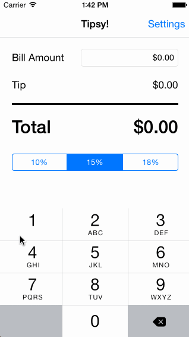

# iOS Tip Calculator written in Swift for CodePath

This is a simple Tip Calculator that I wrote after watching this video: http://vimeo.com/102084767

Some of the features that were implemented:

 * [x] Required: Adds a settings page to allow customization of the tip amounts used
 * [x] Optional: Locale-specific currency ($, £, €, etc) and thousands separators
 * [x] Optional: 10-minute memory of the last used bill amount and tip amount across app restarts
 * [x] Optional: Add light/dark color themes to the settings page
 * [x] ATM-like input for the bill amount (e.g., for $150.15 the user types 1-5-0-1-5)

Walkthrough:

